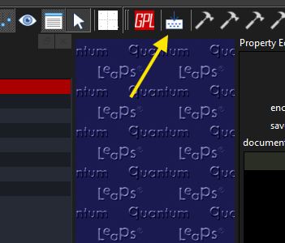
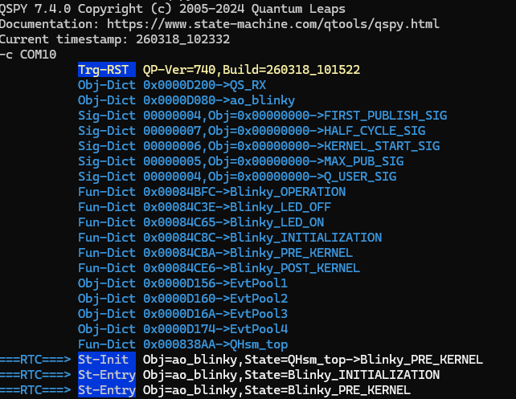

<div align="center">
 
# F28379D QPC Blinky
 
A simple blinky project using FreeRTOS and QPC — a framework for running state machine code generated by QM (a model-based design tool). Learn more at [state-machine.com](https://www.state-machine.com).
 
</div>
 
---
 
## 📋 Index
 
- [About the Project](#-about-the-project)
- [Features](#-features)
- [Technologies](#-technologies)
- [Prerequisites](#-prerequisites)
- [Installation](#-installation)
- [Usage](#-usage)
- [Folder Structure](#-folder-structure)
- [Tests](#-tests)
- [Contributing](#-contributing)
- [License](#-license)
- [Contact](#-contact)
 
---
 
## 📖 About the Project
 
This code serves as a base for model-driven projects on the **LAUNCHXL-F28379D**, a standard launchpad widely used in control applications, particularly in HIL (Hardware-in-the-Loop) setups.
 
A common limitation in HIL workflows is that control code tends to be monolithic — it handles only a single control strategy and lacks failure handling or distinct operational states. This template is designed to bridge the gap between a simple control implementation and a production-grade system.
 
The intended workflow is:
 
```
(HIL Native Generated Code) → (HIL State Machine code using this template) → (Field Code using the same control logic and QM file)
```
 
---
 
## ✨ Features
 
- [x] FreeRTOS integration
- [x] QS over SCI (see more at [state-machine.com](https://www.state-machine.com))
- [x] CPU1 support
- [x] CLA working properly
- [x] Auto-generated dictionaries for signals and states
- [ ] QS over CAN
- [ ] CPU2 support
- [ ] (Submodule) Auto-generated dictionaries for signals and states
- [ ] QUTest support (pronounced "cutest")
 
---
 
## 🛠 Technologies
 
| Technology | Version | Purpose |
|---|---|---|
| [QPC](https://www.state-machine.com) | 7.4.0-rc.3 + custom changes (see [submodule](https://github.com/mon-martins/qpc)) | State Machine Framework |
| [QM](https://www.state-machine.com) | 6.2.3 | State Machine Modeling |
| [QSPY](https://www.state-machine.com) | 7.4.0 | Software Trace |
| [SysConfig](https://www.ti.com/tool/SYSCONFIG) | 1.24.0 | Register configuration interface |
| [C2000Ware](https://www.ti.com/tool/C2000WARE/) | 5.00.00.00 | SDK used by SysConfig and for register manipulation |
| [Python](https://www.python.org/) | Latest | Used to generate the auto dictionary |
| [CCS](https://www.ti.com/tool/CCSTUDIO) | 12.8.1 | Code compiler and editor |
 
---
 
## ✅ Prerequisites
 
Before getting started, make sure you have the following installed:
 
- [SysConfig](https://www.ti.com/tool/SYSCONFIG) >= 1.24.0
- [C2000Ware](https://www.ti.com/tool/C2000WARE/) = 5.00.00.00
- [Git](https://git-scm.com/)
- [Python](https://www.python.org/)
- [Qtools](https://github.com/QuantumLeaps/qtools/releases) = 7.4.0 — **do not use versions above this**, as QSPY is no longer open source in later releases
 
---
 
## 🚀 Installation
 
### 1. Create a repository from the template
 
Access the project on GitHub and use it as a template to create your own repository.
 
🔗 Project link: [https://github.com/mon-martins/qpc_f28379d_model](https://github.com/mon-martins/qpc_f28379d_model)
 

 
### 2. Clone the repository
 
```bash
git clone https://github.com/your-username/your-project-name.git
cd your-project-name
```
 
### 3. Update submodules
 
```bash
git submodule update --init
```
 
### 4. Generate state machine files
 
Open the model file by double-clicking `model.qm`, then click **Generate Code** inside QM.
 

 
Alternatively, from the command line:
 
**Linux:**
```bash
path/to/qm/qmc.sh model.qm
```
 
**Windows:**
```bash
path/to/qm/qmc.exe model.qm
```
 
### 5. Configure your workspace in CCS
 
> Avoid using paths that are too long or that contain special characters — while it may work, it's better to be safe.
 
1. Open CCS and enter your workspace.
2. Import the project: **Getting Started → Import Project**.
3. Verify that your products are recognized:
   - Open project properties: right-click the project → **Properties** (or press `ALT+ENTER`).
   - Navigate to **General → Products** and confirm that **C2000Ware [5.00.00.00]** and **SysConfig [1.24.0]** are listed.
   - If they are missing: click **Add → Preferences**, check that the resources are in the **Product Discovery Path**, then click **Refresh**. The products should now appear under **Discovered Products**.
   - Click **Apply and Close**.
 
---
 
## 💡 Usage
 
### Basic usage
 
1. Connect the USB cable to the Launchpad.
2. Build and deploy the code by clicking the **Debug** button (bug icon).
3. The debugger will automatically halt at the first line of `main`. At this point, you can optionally connect QSPY before resuming execution.
4. Check which COM port is being used for debugging (Device Manager → XDS100v2 under COM Ports).
5. Open a terminal and start QSPY:
 
```bash
qspy -c COM?? -b 115200
```
 
Or, if `qspy` is not in your PATH:
 
```bash
path/to/qspy/bin/qspy -c COM?? -b 115200
```
 
6. Resume execution in CCS.
 


---
 
## 📁 Folder Structure
 
```
📁 QPC_Blinky_F28379D/
├── 📁 cores/
│   ├── 📁 cpu1/
│   │   ├── 📁 application/             # Your application code
│   │   │   ├── 📁 include/             # Header files
│   │   │   ├── 📁 qs_auto_dict/        # QS auto dictionary (will become a submodule in the future)
│   │   │   └── 📁 source/              # Source files
│   │   │       └── 📁 event_triggers/  # Functions called by the BSP when events occur
│   │   ├── 📁 bsp/                     # Board Support Package
│   │   │   ├── 📁 bsp_f28379d_cpu1/                # MCU BSP
│   │   │   ├── 📁 bsp_f28379d_xl_launchpad_cpu1/   # Board BSP
│   │   │   ├── 📁 bsp_interrupts/                  # Interrupt handlers
│   │   │   └── 📁 cla_user_code/                   # CLA user code
│   │   ├── 📁 debug/
│   │   ├── 📁 middleware/              # Third-party or compatibility support code
│   │   ├── 📁 safety/                  # Custom library based on QPC ASSERTs
│   │   └── 📁 targetConfigs/           # CCS files for MCU connection configuration
│   └── 📁 cpu2/                        # CPU2 folder (reserved for future use)
├── 📁 submodules/                      # External repositories
│   └── 📁 qpc/
└── 📁 system_project/                  # System project (reserved for future use)
```
 
> **Note on CLA:** The CLA does not support multiple levels of function nesting. As a result, CLA code is kept in the BSP layer, using direct driverlib calls or register access. CLA source files use the `.cla` extension.
 
---
 
## 🧪 Tests
 
Tests will be added in the future.
 
---
 
## 🤝 Contributing
 
Contributions are welcome! Follow the steps below:
 
1. **Fork** the repository.
2. Create a branch for your feature: `git checkout -b feature/my-feature`
3. Commit your changes: `git commit -m 'feat: add my feature'`
4. Push to the branch: `git push origin feature/my-feature`
5. Open a **Pull Request**.
 
> A `CONTRIBUTING.md` file will be added in the future.
 
### Commit Convention
 
This project follows the [Conventional Commits](https://www.conventionalcommits.org/) standard:
 
| Prefix | Usage |
|---|---|
| `feat:` | New feature |
| `fix:` | Bug fix |
| `docs:` | Documentation update |
| `refactor:` | Code refactoring |
| `test:` | Adding or fixing tests |
 
---
 
## 📄 License
 
This project does not have a license yet. Note that the QPC framework is licensed under the GPL.
 
---
 
## 📬 Contact
 
**Ramon** — ramonbp01@gmail.com
 
🔗 Project link: [https://github.com/mon-martins/qpc_f28379d_model](https://github.com/mon-martins/qpc_f28379d_model)
 
---
 